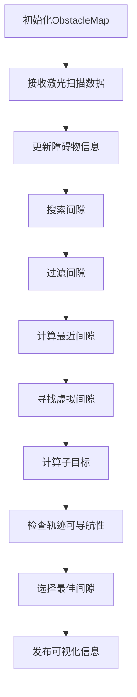
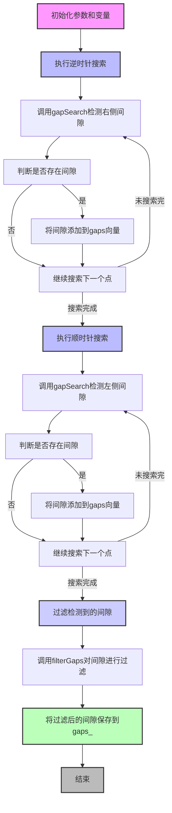

# 程序整体运行架构

# obstacle_map程序分析
obstacle map主要是读取当前的scan消息，然后将scan映射到地图上面，然后在地图上搜索障碍物之间的间隙，过滤间隙，使用最近的间隙来进行导航。

## gapSearch函数
gapSearch函数是用于检测障碍物点云中的相邻的两个障碍物是否存在可以通行的间隙的

判断间隙的条件是

这一部分代码的核心目的是**在当前路径被障碍物阻挡时，动态生成一个新的虚拟间隙 (virtual gap)**。通过分析碰撞点和路径的关系，确定一个可行的虚拟间隙，以便机器人能够找到新的导航路径。下面分步骤解释代码的具体功能和意义。

---

### **代码功能解析**

1. **初始化变量**：
   ```cpp
   unsigned int coll_size = coll_obs.size();
   double min_d = std::numeric_limits<double>::max();
   int close_ind = -1;
   ```
   - `coll_size`：记录路径上发生碰撞的障碍物数量。
   - `min_d`：用于存储与路径最近的障碍物点的最小距离，初始值设置为一个极大值。
   - `close_ind`：用于记录最近障碍物点的索引。

---

2. **找到与路径最近的障碍物点**：
   ```cpp
   for (unsigned int i = 0; i < coll_size; i++)
   {
       geometry_msgs::Point p;

       traj.getClosestPoint(coll_obs[i].point, p); // 找到路径上距离障碍物最近的点
       double closest_dist = dist(coll_obs[i].point, p); // 计算障碍物点到路径点的距离
       if (closest_dist < min_d) // 更新最近距离和对应索引
       {
           min_d = closest_dist;
           close_ind = i;
       }
   }
   ```
   - 遍历碰撞障碍物点集合 `coll_obs`，找到路径上距离每个障碍物点最近的点。
   - 计算障碍物点到路径点的距离，并记录最近的障碍物点索引 `close_ind`。

---

3. **计算路径的中点角度 (mid_angle)**：
   ```cpp
   Obstacle first(coll_obs[close_ind].point, coll_obs[close_ind].angle, coll_obs[close_ind].distance);

   double mid_angle = std::atan2(virt->mid.y, virt->mid.x);
   geometry_msgs::Point org;
   org.x = org.y = org.z = 0.0;
   ```
   - 使用最近的障碍物点（`coll_obs[close_ind]`）作为虚拟间隙的一侧（`first`）。
   - 计算当前间隙中点的角度 `mid_angle`，用于后续对点进行坐标变换。

---

4. **坐标变换到中点参考系**：
   ```cpp
   geometry_msgs::Point trans_f = first.point;
   transformPoint(org, mid_angle, trans_f);
   double trans_fangle = std::atan2(trans_f.y, trans_f.x);

   geometry_msgs::Point trans_r = virt->right.point;
   transformPoint(org, mid_angle, trans_r);
   double trans_rangle = std::atan2(trans_r.y, trans_r.x);

   geometry_msgs::Point trans_l = virt->left.point;
   transformPoint(org, mid_angle, trans_l);
   double trans_langle = std::atan2(trans_l.y, trans_l.x);
   ```
   - 将最近障碍物点 `first`、虚拟间隙的右侧点 `virt->right` 和左侧点 `virt->left` 转换到以 `mid_angle` 为参考的坐标系。
   - 计算它们在这个参考系中的角度（`trans_fangle`、`trans_rangle`、`trans_langle`）。

---

5. **根据障碍物位置选择新虚拟间隙的两侧**：

   这里分为两种情况：
   - 最近的障碍物点 `first` 位于虚拟间隙右侧（`trans_f.y >= 0.0`）。
   - 最近的障碍物点 `first` 位于虚拟间隙左侧（`trans_f.y < 0.0`）。

---

#### **情况 1：障碍物位于右侧**

```cpp
if (trans_f.y >= 0.0)
{
    min_d = dist(virt->right.point, first.point);
    o_ex_tild.push_back(virt->left);

    gamma = trans_fangle - trans_rangle;
    for (unsigned int i = 0; i < o_ex_tild.size(); ++i)
    {
        geometry_msgs::Point trans_p = o_ex_tild[i].point;
        transformPoint(org, mid_angle, trans_p);

        beta = trans_fangle - std::atan2(trans_p.y, trans_p.x);
        dist_ex = dist(o_ex_tild[i].point, first.point);
        if ((gamma < beta) && (beta < M_PI) && (dist_ex < min_d))
        {
            min_d = dist_ex;
            close_ind = i;
        }
    }

    if (close_ind == -1)
    {
        Obstacle other(virt->right.point, virt->right.angle, virt->right.distance);
        virt_gaps.push_back(GapPtr(new Gap(other, first)));
    }
    else
    {
        Obstacle other(o_ex_tild[close_ind].point, o_ex_tild[close_ind].angle, o_ex_tild[close_ind].distance);
        virt_gaps.push_back(GapPtr(new Gap(other, first)));
    }
}
```

- 将最近障碍物点 `first` 定为虚拟间隙的右侧，并尝试寻找一个点作为虚拟间隙的左侧。
- 遍历扩展的外部障碍物集合 `o_ex_tild`，找到距离最近的点，作为虚拟间隙的另一侧。
- 如果没有找到合适的点，则使用原来的虚拟间隙右侧点（`virt->right`）作为虚拟间隙的一侧。

---

#### **情况 2：障碍物位于左侧**

```cpp
else
{
    min_d = dist(virt->left.point, first.point);
    o_ex_tild.push_back(virt->right);

    gamma = trans_langle - trans_fangle;
    for (unsigned int i = 0; i < o_ex_tild.size(); ++i)
    {
        geometry_msgs::Point trans_p = o_ex_tild[i].point;
        transformPoint(org, mid_angle, trans_p);

        beta = std::atan2(trans_p.y, trans_p.x) - trans_fangle;
        dist_ex = dist(o_ex_tild[i].point, first.point);
        if ((gamma < beta) && (beta < M_PI) && (dist_ex < min_d))
        {
            min_d = dist_ex;
            close_ind = i;
        }
    }

    if (close_ind == -1)
    {
        Obstacle other(virt->left.point, virt->left.angle, virt->left.distance);
        virt_gaps.push_back(GapPtr(new Gap(first, other)));
    }
    else
    {
        Obstacle other(o_ex_tild[close_ind].point, o_ex_tild[close_ind].angle, o_ex_tild[close_ind].distance);
        virt_gaps.push_back(GapPtr(new Gap(first, other)));
    }
}
```

- 将最近障碍物点 `first` 定为虚拟间隙的左侧，并尝试寻找一个点作为虚拟间隙的右侧。
- 遍历扩展的外部障碍物集合 `o_ex_tild`，找到距离最近的点，作为虚拟间隙的另一侧。
- 如果没有找到合适的点，则使用原来的虚拟间隙左侧点（`virt->left`）作为虚拟间隙的一侧。

---

### **最终生成虚拟间隙**
- 如果路径不可通行，通过选择最近的障碍物点 `first` 和另一侧的点（`other` 或默认值）生成新的虚拟间隙。
- 新的虚拟间隙被加入到 `virt_gaps` 中，供后续迭代或导航算法使用。

---

### **代码的意义**
- 该代码动态生成新的虚拟间隙，确保机器人在复杂环境中，即使路径被阻挡，仍可以找到替代路径。
- 它通过最近障碍物点的分析，调整虚拟间隙的范围，确保机器人有足够的空间安全通行。

### **代码的核心功能**

`ObstacleMap::findSubGoal` 函数的主要目的是**根据间隙 (Gap) 的位置和宽度计算一个子目标点 (sub-goal)**，供机器人进行避障导航时使用。子目标点是在确保机器人能够通过的情况下，尽可能靠近间隙的中心或者间隙两侧的安全点。以下是代码的详细解析和功能说明：

---

### **代码执行流程**

1. **计算安全距离 (`ds`)**:
   ```cpp
   if (gap.width > (2 * (robot_profile_.radius + robot_profile_.d_safe)))
   {
       ds = robot_profile_.radius + robot_profile_.d_safe;
   }
   else
   {
       ds = 0.5 * gap.width;
   }
   ```
   - 如果间隙的宽度大于两倍的安全通行距离，则设置安全距离 `ds` 为机器人的半径加安全距离 (`robot_profile_.radius + robot_profile_.d_safe`)。
   - 否则，安全距离 `ds` 为间隙宽度的一半 (`0.5 * gap.width`)。

---

2. **生成通向间隙中点的轨迹**:
   ```cpp
   Trajectory mid_traj(gap.mid);

   geometry_msgs::Point pl, pr;
   mid_traj.getClosestPoint(gap.left.point, pl);
   mid_traj.getClosestPoint(gap.right.point, pr);
   ```
   - 生成一条从机器人当前位置到间隙中点的轨迹 `mid_traj`。
   - 找到轨迹上距离间隙左侧点和右侧点最近的两个点 `pl` 和 `pr`。

---

3. **确定需要规避的障碍点 (`pc`)**:
   ```cpp
   if ((dist(pl, gap.left.point) > ds) && (dist(pr, gap.right.point) > ds))
   {
       pc = (gap.close_right) ? gap.right.point : gap.left.point;
       gamma = (gap.close_right) ? -1 : 1;
   }
   else
   {
       bool arc_left = (mid_traj.getLengthArc(pl) <= mid_traj.getLengthArc(pr));

       pc = (arc_left) ? gap.left.point : gap.right.point;
       gamma = (arc_left) ? 1 : -1;
   }
   ```
   - 如果轨迹上最近的点 `pl` 和 `pr` 到间隙两侧的距离都大于安全距离 `ds`：
     - 将间隙的**靠近障碍物侧**（`gap.close_right`）的点设为需要规避的障碍点 `pc`。
   - 否则：
     - 比较轨迹到左侧点 (`pl`) 和右侧点 (`pr`) 的弧长，选择弧长更小的一侧作为需要规避的障碍点 `pc`。
   - `gamma` 是一个方向标志，用于指示障碍物点是左侧 (1) 还是右侧 (-1)。

---

4. **计算切点 (`pt1`, `pt2`)**:
   - 如果障碍物点 `pc` 距离机器人小于安全距离 `ds`：
     ```cpp
     if (std::hypot(pc.x, pc.y) <= ds)
     {
         double rad_c = std::hypot(pc.x, pc.y);

         // Angle to arc fixed
         double th = 0.25 * M_PI;

         pt1.x = rad_c * std::sin(th);
         pt2.x = rad_c * std::sin(-th);
         pt1.y = pt2.y = -rad_c * (1 - std::cos(th));

         r1 = r2 = rad_c;
     }
     ```
     - 计算一个圆心为机器人位置、半径为障碍物点距离的圆，并计算该圆上的两个固定切点。
   - 如果障碍物点 `pc` 距离机器人大于安全距离 `ds`：
     ```cpp
     else
     {
         double circle_eq = pc.x * pc.x + pc.y * pc.y - ds * ds;
         r1 = circle_eq / (2 * (pc.y + ds));
         r2 = circle_eq / (2 * (pc.y - ds));

         if (almostEqual(pc.y, -ds))
         {
             pt1.x = pt2.x = pc.x;
             pt1.y = pt2.y = 0.0;
         }
         else
         {
             double mag1 = std::hypot(pc.x, pc.y - r1);
             double mag2 = std::hypot(pc.x, pc.y - r2);

             pt1.x = (pc.x / mag1) * std::abs(r1);
             pt1.y = r1 + ((pc.y - r1) / mag1) * std::abs(r1);

             pt2.x = (pc.x / mag2) * std::abs(r2);
             pt2.y = r2 + ((pc.y - r2) / mag2) * std::abs(r2);
         }
     }
     ```
     - 根据障碍物点和安全距离构造两个圆的切点。
     - `r1` 和 `r2` 是两个圆的半径，`pt1` 和 `pt2` 是圆上的切点。

---

5. **选择子目标点 (`sub_goal`)**：
   ```cpp
   Trajectory tang_traj1(pt1, r1);
   Trajectory tang_traj2(pt2, r2);
   Trajectory pc_traj(pc);
   if ((proj(tang_traj1.getDirection() - pc_traj.getDirection()) * gamma) < 0)
   {
       sub_goal = pt1;
   }
   else if ((proj(tang_traj2.getDirection() - pc_traj.getDirection()) * gamma) < 0)
   {
       sub_goal = pt2;
   }
   else
   {
       sub_goal = gap.mid;
   }
   ```
   - 构造从机器人位置到切点 `pt1` 和 `pt2` 的虚拟轨迹 `tang_traj1` 和 `tang_traj2`。
   - 如果轨迹方向和障碍点方向相反，则选择对应的切点 `pt1` 或 `pt2` 作为子目标点 `sub_goal`。
   - 如果两个切点方向都不符合，则选择间隙的中点 (`gap.mid`) 作为子目标点。

---

### **代码的意义**
1. **动态计算子目标点**：
   - 子目标点可以是间隙的中点，也可以是根据障碍物位置计算出的安全点。
   - 确保机器人能够安全避开障碍物，同时尽可能通过间隙。

2. **适应复杂环境**：
   - 无论间隙宽度如何，函数都能找到一个合理的子目标点。
   - 如果障碍物较近，会自动调整子目标点的位置。

3. **增强机器人导航的安全性和鲁棒性**：
   - 通过计算切点和安全距离，避免机器人过于靠近障碍物。
   - 提供灵活的目标点选择策略，适应不同的避障场景。

---

### **总结**

`findSubGoal` 函数的核心逻辑是动态生成一个子目标点，使得机器人在通过间隙时既能安全避障，又能尽量接近导航目标。这个功能对机器人在动态环境中的导航尤为重要，能够有效避免碰撞并优化路径规划。