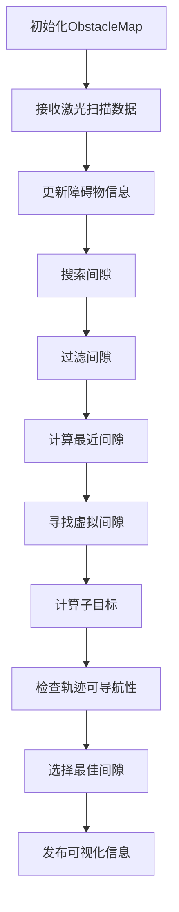
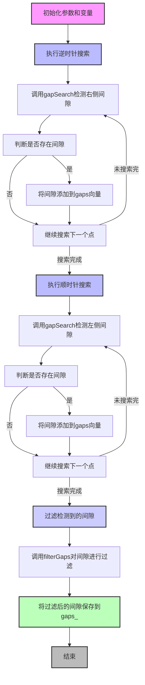

# 程序整体运行架构

# obstacle_map程序分析
obstacle map主要是读取当前的scan消息，然后将scan映射到地图上面，然后在地图上搜索障碍物之间的间隙，过滤间隙，使用最近的间隙来进行导航。

```mermaid
graph TD
    A[初始化ObstacleMap] --> B[接收激光扫描数据]
    B --> C[更新障碍物信息]
    C --> D[搜索间隙]
    D --> E[过滤间隙]
    E --> F[计算最近间隙]
    F --> G[寻找虚拟间隙]
    G --> H[计算子目标]
    H --> I[检查轨迹可导航性]
    I --> J[选择最佳间隙]
    J --> K[发布可视化信息]
```
## gapSearch函数
gapSearch函数是用于检测障碍物点云中的相邻的两个障碍物是否存在可以通行的间隙的

```mermaid
flowchart TD
    A[初始化参数和变量] --> B[执行逆时针搜索]
    B --> B1[调用gapSearch检测右侧间隙]
    B1 --> B2[判断是否存在间隙]
    B2 --> |是| B3[将间隙添加到gaps向量]
    B2 --> |否| B4[继续搜索下一个点]
    B3 --> B4
    B4 --> |未搜索完| B1
    B4 --> |搜索完成| C[执行顺时针搜索]

    C --> C1[调用gapSearch检测左侧间隙]
    C1 --> C2[判断是否存在间隙]
    C2 --> |是| C3[将间隙添加到gaps向量]
    C2 --> |否| C4[继续搜索下一个点]
    C3 --> C4
    C4 --> |未搜索完| C1
    C4 --> |搜索完成| D[过滤检测到的间隙]

    D --> D1[调用filterGaps对间隙进行过滤]
    D1 --> E[将过滤后的间隙保存到gaps_]
    E --> F[结束]

    style A fill:#f9f,stroke:#333,stroke-width:2px;
    style B fill:#bbf,stroke:#333,stroke-width:2px;
    style C fill:#bbf,stroke:#333,stroke-width:2px;
    style D fill:#ccf,stroke:#333,stroke-width:2px;
    style E fill:#bfb,stroke:#333,stroke-width:2px;
    style F fill:#bbb,stroke:#333,stroke-width:2px;
 
```
判断间隙的条件是